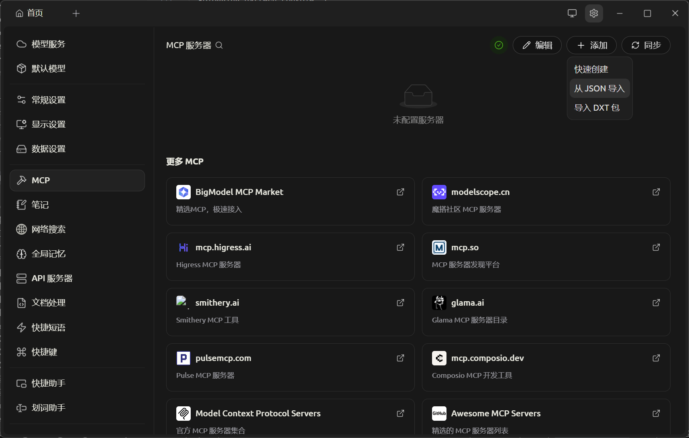
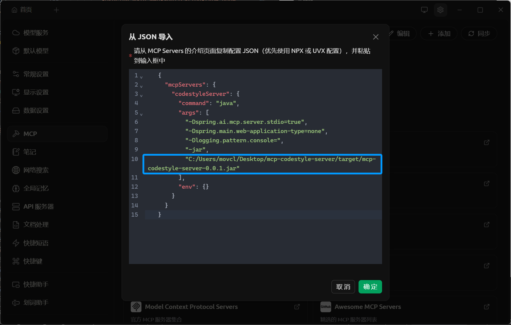
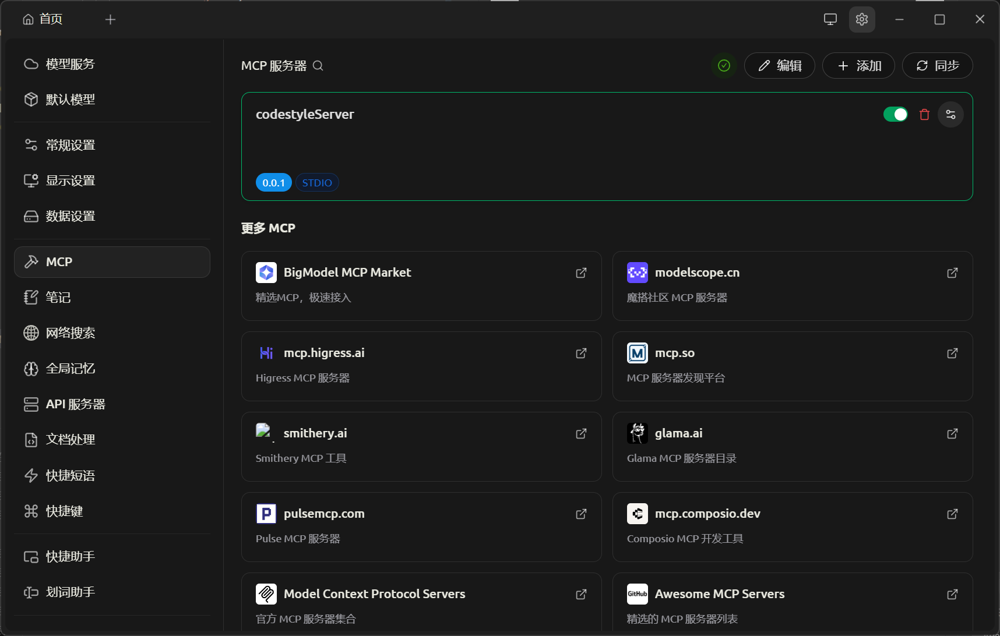
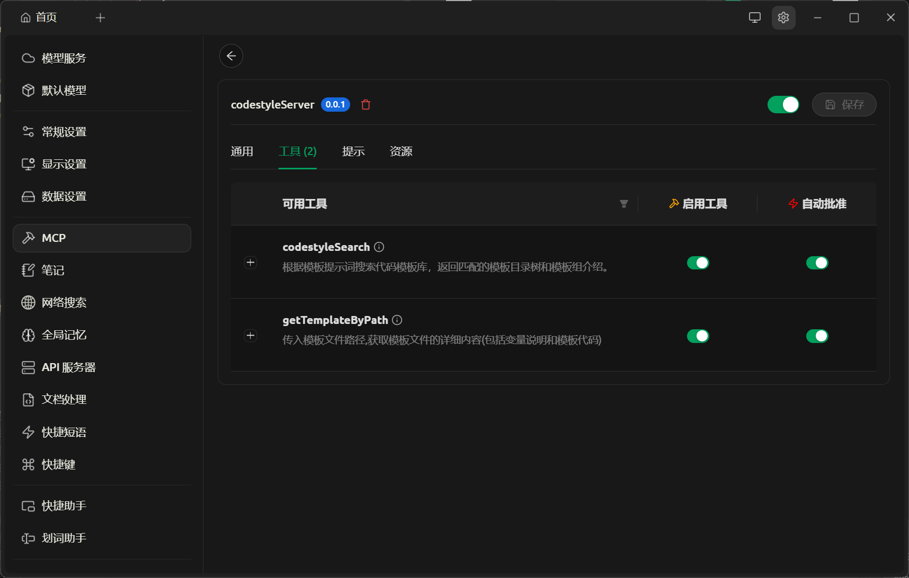
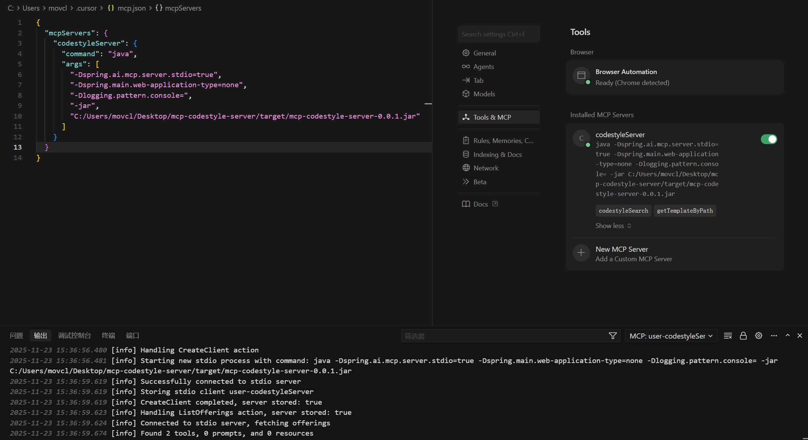

# MCP 代码模板服务器

MCP Codestyle Server 是一个基于 Spring AI 实现的 Model Context Protocol (MCP) 服务器，为 IDE 和 AI 代理提供代码模板搜索和检索工具。该服务从本地缓存查找模板，并在缺失时自动从远程仓库下载元数据和文件进行修复。

## 核心特性
- **原生 MCP 工具**：`CodestyleService` 通过 `spring-ai-starter-mcp-server` 注册 `codestyleSearch` 和 `getTemplateByPath` 工具，STDIO 客户端（Cherry Studio、Cursor 等）可直接调用
- **增量更新机制**：通过 SHA256 哈希值比对判断模板是否需要更新，避免重复下载
- **自修复模板缓存**：本地未找到模板时自动触发远程下载，支持按需获取
- **精确路径定位**：从请求路径解析 `groupId/artifactId`，直接定位 `meta.json`
- **提示词模板化**：`PromptService` 使用 `content-result.txt` 和 `search-result.txt` 渲染响应，确保变量和文件内容遵循统一布局
- **多版本共存**：采用 `groupId/artifactId/version/` Maven 风格目录结构，支持同一模板的多版本管理

## 技术栈
- Java 17, Maven 3.9+
- Spring Boot 3.2.5
- Spring AI MCP Server 1.1.0
- Hutool 5.8.25（HTTP、文件、JSON、ZIP 工具）

## 架构设计

### 分层架构
```
┌─────────────────────────────────────────────────────────────┐
│                    MCP 客户端 (Cursor/Cherry Studio)         │
└─────────────────────────────────────────────────────────────┘
                              │ STDIO
                              ▼
┌─────────────────────────────────────────────────────────────┐
│  CodestyleService (@McpTool)                                │
│  ├── codestyleSearch(keyword)     → 目录树 + 模板组介绍        │
│  └── getTemplateByPath(path)      → 变量说明 + 模板内容        │
└─────────────────────────────────────────────────────────────┘
                              │
                              ▼
┌─────────────────────────────────────────────────────────────┐
│  TemplateService (业务编排层)                                 │
│  ├── searchLocalRepository()      → 本地仓库搜索              │
│  ├── searchByPath()               → 精确路径搜索 + 自动修复     │
│  ├── fetchRemoteMetaConfig()      → 获取远程配置              │
│  └── smartDownloadTemplate()      → 智能下载                 │
└─────────────────────────────────────────────────────────────┘
                              │
                              ▼
┌─────────────────────────────────────────────────────────────┐
│  SDKUtils (核心工具层)                                        │
│  ├── searchLocalRepository()      → 按 groupId/artifactId 搜索│
│  ├── searchByPath()               → 精确路径匹配              │
│  ├── fetchRemoteMetaConfig()      → HTTP 请求远程 API         │
│  ├── smartDownloadTemplate()      → SHA256 比对 + 增量下载    │
│  ├── checkIfNeedsUpdate()         → 版本/文件/哈希 检查        │
│  └── downloadAndExtractTemplate() → ZIP 下载解压 + meta 合并  │
└─────────────────────────────────────────────────────────────┘
                              │
                              ▼
┌─────────────────────────────────────────────────────────────┐
│  本地缓存 (codestyle-cache/)                                 │
│  └── {groupId}/{artifactId}/meta.json + {version}/...       │
└─────────────────────────────────────────────────────────────┘
```

## 项目结构
```text
mcp-codestyle-server
├── pom.xml
├── src/main
│   ├── java/top/codestyle/mcp
│   │   ├── McpServerApplication.java        # 应用入口
│   │   ├── config
│   │   │   └── RepositoryConfig.java        # 仓库路径配置（支持降级）
│   │   ├── model
│   │   │   ├── meta/                        # 本地缓存模型
│   │   │   │   ├── LocalMetaConfig.java     # 本地 meta.json 结构（多版本）
│   │   │   │   ├── LocalMetaInfo.java       # 本地模板元信息
│   │   │   │   └── LocalMetaVariable.java   # 本地变量（预留扩展）
│   │   │   ├── sdk/                         # SDK 模型
│   │   │   │   ├── MetaInfo.java            # 通用模板元信息
│   │   │   │   ├── MetaVariable.java        # 模板变量
│   │   │   │   └── RemoteMetaConfig.java    # 远程 API 响应结构（单版本）
│   │   │   └── tree/                        # 目录树模型
│   │   │       ├── Node.java                # 节点接口
│   │   │       └── TreeNode.java            # 树节点实现
│   │   ├── service
│   │   │   ├── CodestyleService.java        # MCP 工具实现（@McpTool）
│   │   │   ├── TemplateService.java         # 模板业务编排
│   │   │   └── PromptService.java           # 提示词模板加载（懒加载）
│   │   └── util
│   │       ├── SDKUtils.java                # 核心工具（搜索/下载/SHA256）
│   │       ├── MetaInfoConvertUtil.java     # 元信息转换
│   │       └── PromptUtils.java             # 目录树和变量格式化
│   └── resources
│       ├── application.yml                  # 配置文件
│       ├── content-result.txt               # 模板内容提示词模板
│       └── search-result.txt                # 搜索结果提示词模板
└── examples/               # 示例增删改查模板(匹配Continew Admin Ver4.0.0)
```

## 配置说明
核心配置位于 `src/main/resources/application.yml`，可通过 JVM 系统属性覆盖。

```yaml
spring:
  application:
    name: mcp-codestyle-server
  main:
    web-application-type: none      # 关闭Web服务器
    banner-mode: off                # 关闭启动横幅
  ai:
    mcp:
      server:
        name: mcp-codestyle-server  # MCP服务器名称
        version: 0.0.1              # 版本号
        stdio: true                 # 启用STDIO模式

repository:
  local-path: /var/cache/codestyle        # 本地基础路径
  remote-path: http://localhost      # 远程仓库地址（需配置）
  dir:   # 可选，不配置则使用local-path/codestyle-cache
```

### 配置项说明：
- `repository.local-path`：本地缓存基础目录（可通过 `-Dcache.base-path` 覆盖）
- `repository.dir`：具体缓存文件夹，默认为 `<local-path>/codestyle-cache`
- `repository.remote-path`：**必须配置**，远程仓库基础URL

### 远程服务接口：
远程服务提供以下两个接口：

1. **获取模板元数据**
   ```
   GET {remoteBaseUrl}/api/mcp/search?templateKeyword=CRUD
   ```
   返回 `RemoteMetaConfig` JSON 格式：
   ```json
   {
     "groupId": "backend",
     "artifactId": "CRUD",
     "description": "完整的CRUD操作模板",
     "config": {
       "version": "1.0.0",
       "files": [
         {
           "filePath": "/src/main/java/com/air/controller",
           "filename": "Controller.ftl",
           "description": "控制器模板",
           "sha256": "abc123...",
           "inputVariables": [
             {
               "variableName": "className",
               "variableType": "String",
               "variableComment": "类名",
               "example": "UserController"
             }
           ]
         }
       ]
     }
   }
   ```

2. **下载模板ZIP**
   ```
   GET {remoteBaseUrl}/api/file/load?paths=/groupId/artifactId
   ```
   返回包含模板文件的 ZIP 压缩包，解压后目录结构应为：
   ```
   src/
     main/
       java/
         com/
           air/
             controller/
               Controller.ftl
   ```

## 快速开始

### 1. 前置条件
- JDK 17+
- Maven 3.9+（或使用项目自带的 `mvnw` / `mvnw.cmd`）

### 2. 克隆并构建
```bash
git clone https://github.com/itxaiohanglover/mcp-codestyle-server.git
cd mcp-codestyle-server
./mvnw clean package -DskipTests
```

### 3. 配置远程仓库地址
编辑 `src/main/resources/application.yml`，将 `repository.remote-path` 修改为实际的远程服务器地址：
```yaml
repository:
  remote-path: http://your-server.com  # 替换为实际地址
```

### 4. 运行 MCP 服务器
```bash
# Windows
java ^
  -Dspring.ai.mcp.server.stdio=true ^
  -Dspring.main.web-application-type=none ^
  -Dlogging.pattern.console= ^
  -Dcache.base-path=C:/mcp-cache ^
  -Drepository.remote-path=http://your-server.com ^
  -jar target/mcp-codestyle-server-0.0.1.jar

# Linux/macOS
java \
  -Dspring.ai.mcp.server.stdio=true \
  -Dspring.main.web-application-type=none \
  -Dlogging.pattern.console= \
  -Dcache.base-path=/mcp-cache \
  -Drepository.remote-path=http://your-server.com \
  -jar target/mcp-codestyle-server-0.0.1.jar
```

### 5. 配置 MCP 客户端

#### Cherry Studio 配置示例
在设置 -> MCP Servers 中添加：
```json
{
  "mcpServers": {
    "codestyleServer": {
      "command": "java",
      "args": [
        "-Dspring.ai.mcp.server.stdio=true",
        "-Dspring.main.web-application-type=none",
        "-Dlogging.pattern.console=",
        "-jar",
        "C:/path/to/mcp-codestyle-server/target/mcp-codestyle-server-0.0.1.jar"
      ],
      "env": {}
    }
  }
}
```

注意实际jar路径和参数配置一致

添加成功

通过配置按钮可以查看到两个工具已注册


#### Cursor 配置示例
在 `~/.cursor/mcp_settings.json` 中添加：
```json
{
  "mcpServers": {
    "codestyleServer": {
      "command": "java",
      "args": [
        "-Dspring.ai.mcp.server.stdio=true",
        "-Dspring.main.web-application-type=none",
        "-Dlogging.pattern.console=",
        "-jar",
        "/path/to/mcp-codestyle-server/target/mcp-codestyle-server-0.0.1.jar"
      ]
    }
  }
}
```

启用服务器后，在聊天界面即可调用工具。

## MCP 工具

### 1. codestyleSearch - 搜索模板目录树
**参数：**
- `templateKeyword` (String): 模板关键词
  - 示例：`CRUD`、`backend`、`frontend`

**响应示例：**
```
找到模板组: CRUD

目录树:
backend/
  CRUD/
    1.0.0/
      src/
        main/
          java/
            com/
              air/
                controller/
                  └── Controller.ftl
                service/
                  └── Service.ftl

模板组介绍:
完整的CRUD操作模板，包含控制器、服务层、数据访问层等
```

**执行流程：**
```
1. fetchRemoteMetaConfig(keyword)     → 调用远程 API 获取模板配置
2. smartDownloadTemplate(config)      → SHA256 比对，按需下载
3. searchLocalRepository(groupId, artifactId)  → 从本地 meta.json 读取文件列表
4. PromptUtils.buildTree(metaInfos)   → 构建目录树结构
5. promptService.buildSearchResult()  → 格式化输出
```

### 2. getTemplateByPath - 获取模板详细内容
**参数：**
- `templatePath` (String): 完整模板路径
  - 格式：`groupId/artifactId/version/filePath/filename`
  - 示例：`backend/CRUD/1.0.0/src/main/java/com/air/controller/Controller.ftl`

**响应示例：**
```
#文件名：backend/CRUD/1.0.0/src/main/java/com/air/controller/Controller.ftl
#文件变量：
- className: 类名（示例：UserController）[String]
- packageName: 包名（示例：com.air.controller）[String]
#文件内容：
package ${packageName};

public class ${className} {
    // CRUD方法
}
```

**执行流程：**
```
1. searchByPath(path)                 → 从路径解析 groupId/artifactId，直接定位 meta.json
2. 如未找到 → fetchRemoteMetaConfig() + smartDownloadTemplate()  → 自动修复
3. readTemplateContent()              → 读取模板文件内容
4. promptService.buildPrompt()        → 格式化输出（变量 + 内容）
```

## 模板仓库结构

### 本地缓存目录结构
```
codestyle-cache/
└── backend/                    # groupId
    └── CRUD/                   # artifactId
        ├── meta.json          # 元数据配置
        └── v1.0.0/            # version
            └── src/
                └── main/
                    └── java/
                        └── com/
                            └── air/
                                └── controller/
                                    └── Controller.ftl
```

### meta.json 格式（本地）
```json
{
  "groupId": "backend",
  "artifactId": "CRUD",
  "configs": [
    {
      "version": "1.0.0",
      "files": [
        {
          "filePath": "/src/main/java/com/air/controller",
          "filename": "Controller.ftl",
          "description": "控制器模板",
          "sha256": "abc123...",
          "inputVariables": [
            {
              "variableName": "className",
              "variableType": "String",
              "variableComment": "类名",
              "example": "UserController"
            }
          ]
        }
      ]
    }
  ]
}
```

**特点：**
- 支持多版本共存（`configs` 数组）
- SHA256 校验保证文件完整性
- 精确的文件路径和变量描述

## 提示词模板

### content-result.txt（模板内容）
```
#文件名：%{s}
#文件变量：
%{s}
#文件内容：
%{s}
```
- 3个占位符：文件名、变量列表、模板内容

### search-result.txt（搜索结果）
```
找到模板组: %{s}

目录树:
%{s}
模板组介绍:
%{s}
```
- 3个占位符：groupId/artifactId、目录树、描述

可编辑这些文件以适配不同 MCP 客户端的响应风格。

## 核心逻辑详解

### 模板更新机制

```
用户搜索模板 (codestyleSearch)
        │
        ▼
┌───────────────────────┐
│ 1. 获取远程配置        │  fetchRemoteMetaConfig(keyword)
│    (远程API返回)       │  → 返回 groupId, artifactId, version, 文件列表+SHA256
└───────────────────────┘
        │
        ▼
┌───────────────────────┐
│ 2. 智能下载判断        │  smartDownloadTemplate(remoteConfig)
└───────────────────────┘
        │
        ▼
   本地 meta.json 存在？
        │
   ┌────┴────┐
   │ 否      │ 是
   ▼         ▼
需要下载   ┌─────────────────────┐
           │ 3. 检查是否需要更新  │  checkIfNeedsUpdate()
           └─────────────────────┘
                    │
        ┌───────────┼───────────┐
        ▼           ▼           ▼
   版本不存在？  文件不存在？  SHA256变化？
        │           │           │
        └─────┬─────┴───────────┘
              ▼
         需要更新？
        ┌────┴────┐
        │ 否      │ 是
        ▼         ▼
      跳过    ┌─────────────────────┐
              │ 4. 下载并解压        │  downloadAndExtractTemplate()
              │    - 备份本地meta    │
              │    - 请求远程ZIP     │
              │    - 解压到本地仓库  │
              │    - 合并更新meta    │
              └─────────────────────┘
```

### 更新触发条件

| 条件 | 触发更新 |
|------|---------|
| 本地 meta.json 不存在 | ✅ |
| 远程版本在本地不存在 | ✅ |
| 远程文件在本地不存在 | ✅ |
| 文件 SHA256 不一致 | ✅ |
| 所有文件 SHA256 一致 | ❌ 跳过下载 |

### 版本合并策略

下载新版本时会**保留本地已有版本**：

```
场景：本地已有 v0.9.0，远程推送了 v1.0.0

1. 备份本地 meta.json（包含 v0.9.0 配置）
2. 下载并解压远程 ZIP
3. 删除远程带来的 meta.json（只含单版本）
4. 从备份恢复，追加 v1.0.0 配置
5. 最终 meta.json 包含：v0.9.0 + v1.0.0
```

## 开发与测试

### 运行集成测试
```bash
mvn test
```

或运行 `CodestyleServiceTest.main()` 方法：
```java
// 通过 STDIO 启动 JAR 并调用 MCP 工具
CodestyleServiceTest.main(new String[]{});
```

### 扩展新模板
1. 在远程仓库添加新的模板 ZIP 和对应的 JSON 配置
2. 确保 `meta.json` 中的 `sha256` 与实际文件哈希一致
3. 运行测试验证端到端流程

### 调试技巧
- 查看日志：移除 `-Dlogging.pattern.console=` 参数
- 检查缓存：查看 `repository.dir` 配置的目录
- 验证远程接口：使用 `curl` 或 Postman 测试远程 API

## 常见问题

### Q: 如何清理本地缓存？
A: 删除 `repository.dir` 配置的目录，下次运行时会自动重新下载。

### Q: 如何支持多用户？
A: 为每个用户配置不同的 `cache.base-path`，或在 `groupId` 前添加用户标识。

### Q: 远程仓库不可用时如何处理？
A: 系统会继续使用本地缓存，并返回友好的错误提示。

### Q: 为什么下载后本地 meta.json 和远程不一样？
A: 本地 meta.json 使用 `configs` 数组支持**多版本共存**，而远程返回的是单版本的 `config` 对象。下载时会自动转换并合并。

### Q: SHA256 校验失败怎么办？
A: 删除对应模板目录（如 `codestyle-cache/backend/CRUD/`），系统会重新下载完整模板。

## 许可证
基于 [MIT License](LICENSE) 发布。

## 作者
- artboy (itxaiohanglover)
- Kanttha
- movclantian

## 更新日志
- **v0.0.1** (2025-11-27)
  - 初始版本
  - 支持 `codestyleSearch` 和 `getTemplateByPath` 工具
  - Maven 风格目录结构
  - SHA256 增量更新机制
  - 自动修复机制（本地缺失时触发下载）
  - 多版本共存支持
  - 精确路径定位优化
